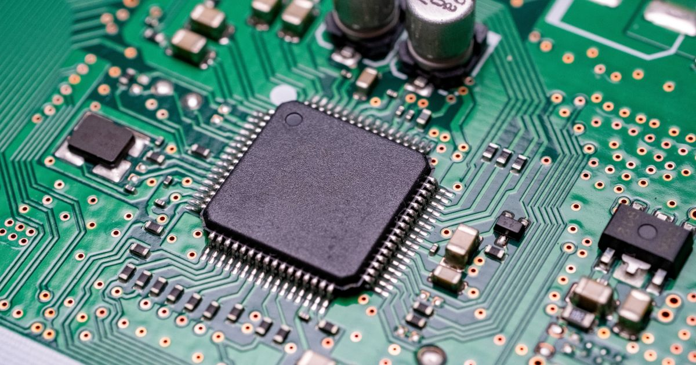
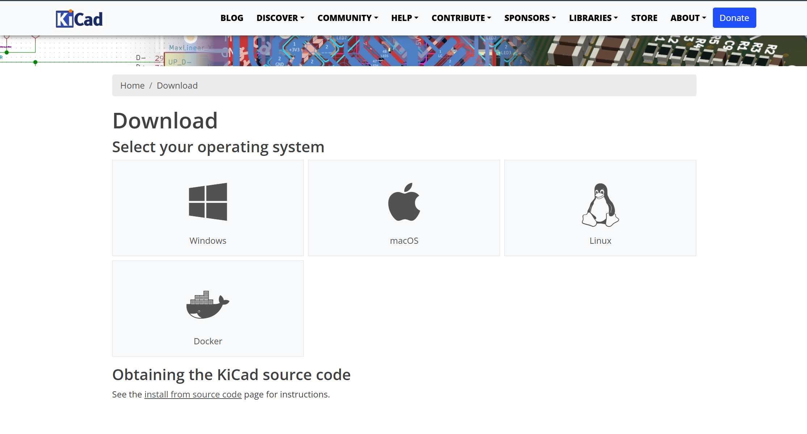
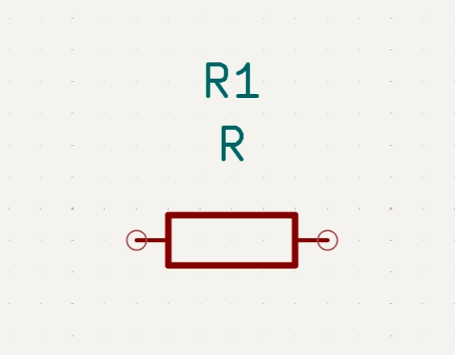
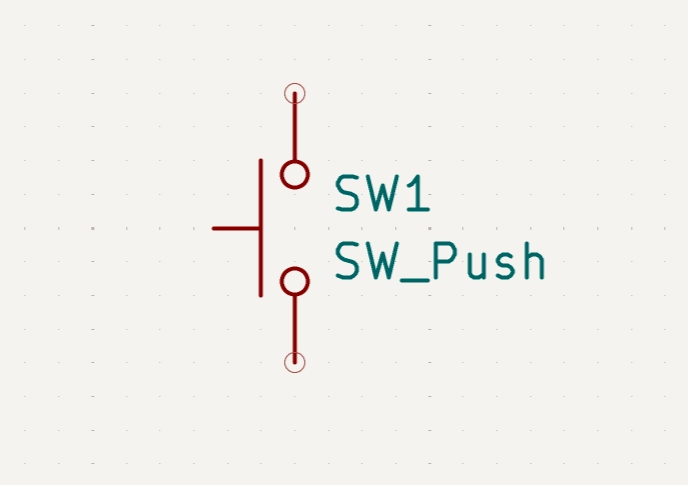

# How to build your first PCB

This article covers the basics of all you need to know to design your first printed circuit board (PCB). If you are fairly familiar with what PCB is and what it does, feel free to jump into the instructions. If you have any feedback or questions, please slack me at @afia ava. 

## **What is a Printed Circuit Board (PCB)?**

A PCB is a foundational component in electronics, designed as a board (usually with fiberglass), that physically supports and electrically connects components like chips and resistors using copper traces. These are essential for routing signals in devices, ranging from simple single-layer boards to complex, multi-layer motherboards. These are used in almost every electronic device. For example, phones, laptops, cameras, robots, rockets, etc. 

You can use a breadboard to prototype; however, with a PCB, the components are soldered onto the board instead of having wires everywhere. The copper traces act like tiny wires that connect components together so electricity flows through the correct path in a complete circuit. You may consider the components as buildings, the traces as roads, and electric current as cars traveling between them. The point is, it is a clean, compact, and reliable way for electrical components to work. 

## **Types of PCB**

Single-layer PCB: one layer of copper traces and simplest to make

Double-layer PCB: traces on top and bottom, can fit more connections

Multi-layer PCB: many layers, used in computers, phones, and complex electronics

## **Materials to Build Your PCB**

Design phase:

1. PCB Design software (e.g. KiCad, EasyEDA)

Build phase:

1. PCB Manufacturer (e.g. PCBWAY, JLCPCB, etc.)
2. Components (e.g. resistors, LEDs, microcontrollers, etc.)
3. Soldering tools

Here, I’ve only covered instructions on the design phase. I will hopefully soon make a more detailed tutorial on the build phase as well. 

# **Instructions**

## Step One: Installing the Software

To design your PCB, you’ll need to install KiCad, a free and open-source PCB design tool. KiCad works on Windows, macOS, and Linux, and it provides everything you need to create schematics, lay out your board, and generate files for manufacturing. To install, [download](https://www.kicad.org/download/) the latest version from the official KiCad website, follow the installation prompts, and open the program. Once installed, you’ll be ready to start designing your first PCB project!

P.S. There is no functional difference across the locations mentioned. For North America, you could get either the GitHub or MIT one. 

## Step Two: Creating Schematic

### Placing Components

The next step is to create a schematic, which is a digital diagram of your circuit. Open KiCad, and create a new project from file. Here, we will be placing components like resistors, LEDs, and the 555 timer using the built-in component library. 

In this tutorial, we are creating a heart-shaped PCB. For a schematic, the shape doesn’t really matter yet. It’s a logical design. 

The components we’ll be using are:

- x16+ Red Leds
- x1 555 Timer IC
- x1 10 μF Capacitor
- x1 100k Variable Resistor
- x1 10k Resistor
- x1 330 ohm resistors
- x1 1 Push Button
- x1 9V Battery Holder Clip

Now open the schematic editor and use the “Add Symbol” tool to search for and insert components from the built-in library. 

We’re going to use a 555 timer IC to make the LEDs blink on and off repeatedly. In the search bar of place components, look for ICM7555xB. 

ICM7555xB
Derived from NE555D (Precision Timers, 555 compatible, SOIC-8)
CMOS General Purpose Timer, 555 compatible, SOIC-8
Keywords: single timer 555

Now we’re going to add the resistors. The 330 ohm resistor is placed between the timer output and the LEDs to control how much current flows. The 10k ohm resistor, together with the capacitor and variable resistor, controls how fast the LEDs blink. The 100k variable resistor (or you could say potentiometer) lets you adjust the blinking speed of the LEDs or LED brightness.

Now look up resistors in the place component search bar and add 2 resistors and 1 variable resistor. 

R
Resistor
Keywords: R res resistor

R_Variable
Variable resistor
Keywords: R res resistor variable potentiometer rheostat

P.S: After you add the components, you can rotate their position with the shortcut R key. 

Afterwards, we’re going to add the 10 µF capacitor, which works with the resistor to create the timing cycle. The capacitor charges and discharges repeatedly, which makes the 555 timer output switch on and off, creating the blinking effect. 

In the place component search bar, look up polarized capacitor.

C_Polarized
Polarized capacitor
Keywords: cap capacitor

Now we are going to add the push button switch (SW), which is used to turn on the lights when you press it. In your heart PCB, the pushbutton acts as a momentary switch that connects the battery to the circuit only while it's pressed by closing the circuit. To add the momentary switch, look for the SW Push Button. 

SW_Push
Push button switch, generic, two pins
Keywords: switch normally-open pushbutton push-button

Now we need to add the battery. To do so, look up BT and add it to your schematic diagram. 

Battery
Multiple-cell battery
Keywords: batt voltage-source cell

Next, add the ground (GND) connection to the schematic. It represents the reference point of the circuit and provides a path for electrical current to return to the battery. It should be connected to the GND of the 555 timer IC and the cathode (negative side) of the battery. 

GND
Power symbol creates a global label with name "GND" , ground
Keywords: global power

You should also place a PWR_FLAG symbol on the power line coming from the battery. The power flag isn’t a real component in the physical circuit; instead, it tells KiCad that the wire is intentionally supplying power. This prevents showing electrical rule check warnings and makes the design properly powered. 

PWR_FLAG
Special symbol for telling ERC where power comes from
Keywords: flag power

You will also need LEDs, as many as you want to be on your PCB board. For this heart PCB, I’ll be adding 16 of them. In the same process, look up for LED and GND to add in the cathode (negative part). In an LED symbol, the end with the straight line is the cathode. 

LED
Light emitting diode
Keywords: LED diode

GND
Power symbol creates a global label with name "GND" , ground
Keywords: global power

Now, we’re going to add labels from the timer’s pin 3. It is the output pin that switches on and off to create the blinking effect. Without a label, we need to wire the anode from all LEDs to this pin 3. However, with a label, we can wire two pins without adding physical wire between them. As long as both pins have the same name, KiCan knows that they’re connected. 

Click "Global Labels” in the right sidebar (shortcut key Ctrl + L) and create the label TOUT (timer output). Now add this label to pin 3 of your timer 555 as well as to all the anodes (positive sides) of each LED.  

This is how the LED schematic should look like:

### Assign Footprints

The footprints are the physical shapes of the parts that will go on yotu PCB. Each component in your schematic needs a footprint so that KiCad knows how to place it and where to solder it on the board. 

On the top menu bar of the schematic page, go to Tools and then to Assign Footprints. A window will open showing all your components on the left and the footprint library on the right. In the search bar above, you can search for the name of the footprints and add it to the components. 

Battery: Connector_Wire:SolderWire-0.1sqmm_1x02_P3.6mm_D0.4mm_OD1mm
C_Polarized:
Capacitor_THT:CP_Radial_D5.0mm_P2.50mm
LED:
LED_THT:  LED_D5.0mm
R:
Resistor_THT:R_Axial_DIN0207_L6.3mm_D2.5mm_P7.62mm_Horizontal
R_Variable:Potentiometer_THT: Potentiometer_Bourns_3386P_Vertical
SW_Push:
Button_Switch_THT:SW_PUSH_6mm
ICM7555xB:
Package_SO:SOIC-8_3.9x4.9mm_P1.27mm

After you add these footprints, click “Apply, Save Schematic & Continue” button. 

### Wiring the diagram

Now that all components are placed, it’s time to wire them together. Wiring the diagram is basically connecting all parts of your circuit where electricity flows. Drawing wires in the schematic shows how each part should connect, which helps the PCB software know where to place traces later and ensure that your circuit will actually function! 

To draw wires, you can select the draw wire option on the right sidebar, or else choose shortcut key W and double-click to end drawing. 

**Powering the Circuit** 

- Connect the battery positive (+) to the push button input
- Connect the push button output to Pin 8 (VCC) of the 555 timer and Pin 4 (Reset)

**Timing Circuit**

- Connect Pin 7 (Discharge) to 10k resistor to pin 2 (Trigger) and 6 (Threshold)
- Connect Pin 7 also to the 100k variable resistor and VCC (pin 8)
- Connect the 10µF capacitor between Pin 2/6 (positive) and GND (negative)

**Output to LEDs**

- Connect Pin 3 (output) to 330 ohm resistor

**Final Checks**

- Place PWR_FLAG on the wire connecting Pin 4 and VCC
- Run Inspect and then Electrical Rules Check (ERC) to catch any unconnected pins or mistakes

You are now done with the schematic of your first PCB project!!! 

## Step Three: PCB Layout

### Exporting to PCB Editor

As you are done with schematic, you need to open your schematic in the PCB editor. In the top menu bar, click on "switch to PCB editor.” It will open a new tab in the PCB editor with all the components in the schametic file. 

### Drawing the Shape

Now we’ll be drawing the shape for how we want the PCB to be manufactured. It’s very common to go for a rectangular shape board, but as we’re working on makign a heart PCB we will draw the heart now. 

First, you should make sure that you are on the Edge.Cuts layer. Anything you draw on this layer becomes the physical boundary of your PCB. So now with the drawing tool on the right side bar (using line, arc, shapes) we draw the heart shape. Make sure to connect all the points and so that it is a closed loop. Later, you will place all of your components inside this outline. 

### Arrange the Components

Now arrange all your components inside the outline you just drew. For this heart PCB, I’ll be putting all the LEDs all around the corner and the 555 timer, resistors, capacitor, push button in the middle. You are free to choose where to place what components on your PCB board. However, make sure you don’t cram all of components in one spot because you need enough roon to draw the copper traces (wires) between pins. 

### Routing PCB

Now that all your components are places, it’s time to connect them with copper traces. This process is called routing! It is like drawing the roads that electricity will follow to flow between your compoents. 

Now you should be on [F.Cu](http://F.Cu) (front copper) layer. I’m using the copper width of 0.25 mm. You can choose the width from a drop down bar in the top menu. 

Select the route single track button on the right side and connect the pins by following the blue lines. Click on the pin from where you want to start and then click again on the pin where you want to connect to. This way, you will have a copper trace along this path. Now as you keep on completing these traces, there will be some paths that you can’t cross over and connect because a copper trace can’t overlap on another trace. In this case, after you’re done with all possible connections on the front layer, go to the [B.Cu](http://B.Cu) (back copper) layer and connect the rest of the tracing in the back side. It’s best that you try to make the traces short and direct, witout unnessary bends for the sake of looking pretty!

After you are done tracing to route the PCB, you should always run the Design Rule Check (DRC). It will show any errors you have on the tracing, in terms of hacing extra tracing not connected to anywhere and such. Fix any errors the DRC finds before exportign your PCB for manufacturing. 

## Step Four: Export the PCB Board

YAYY! You just finished designing yoru first PCB!

### View the 3D PCB Board

Now is the fun part of taking a look at your PCB board in the 3D viewer. In the top menu, there’s an option for 3D view. You should inspect your PCB from all angles and make sure it looks like the way you want it to be manufactured. 

### Download Your PCB for Manufacturing

If  you are planning to manufacture your PCB board, you need to export it as files a manufacturer can use. These are called Gerber Files. 

To download Gerber, go to file and then plot. Make sure all the necessary layers are selected. Then plot the gerber file and you’re ready to send this to a manufacturer. 

And that's all! You've just designed your first PCB. From schematic to layout to Gerber files, yoy now know the full design workflow. If you run into any issues, please feel free to slack me at @afia ava. Happy making!